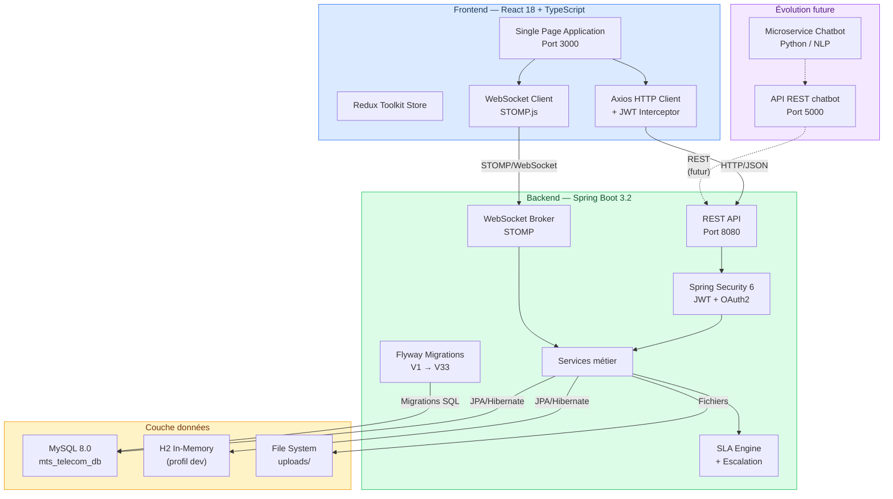
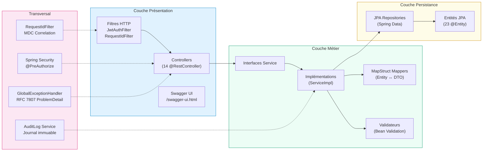
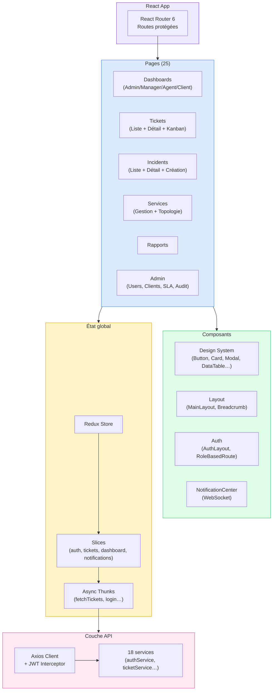
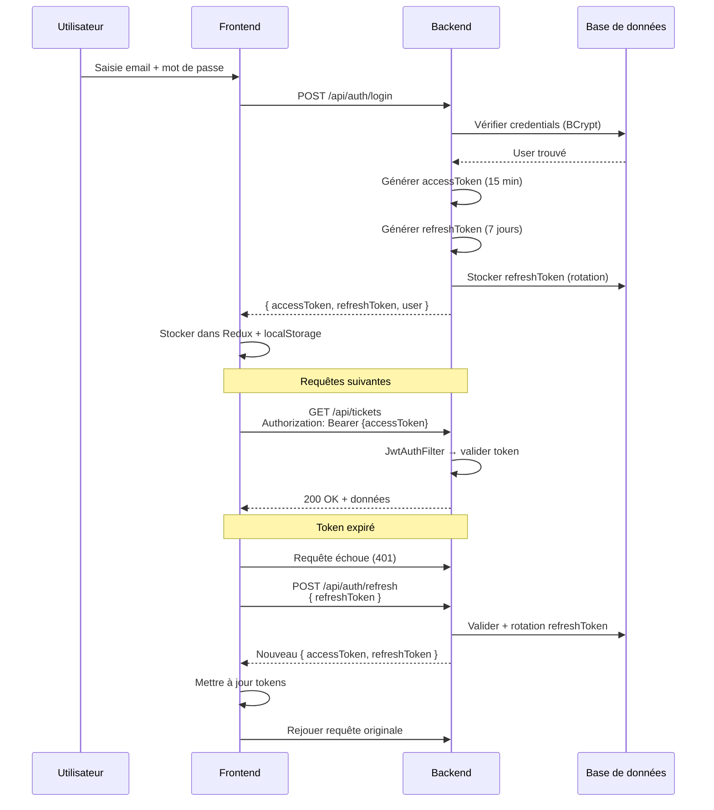
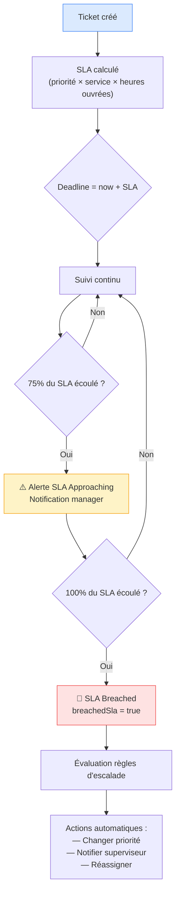

# Architecture — MTS Telecom Supervisor

---

## 1. Vue d'ensemble



---

## 2. Architecture backend — Couches



### Détail des couches

| Couche | Rôle | Exemples |
|--------|------|----------|
| **Controller** | Point d'entrée HTTP, validation `@Valid`, sécurité `@PreAuthorize`, délégation au service | `TicketController`, `AuthController`, `IncidentController` |
| **DTO** | Objets de transfert — découplent l'API des entités JPA | `TicketCreateRequest`, `TicketResponse`, `LoginRequest` |
| **Service** | Logique métier, orchestration, calculs SLA, gestion de l'escalade | `TicketServiceImpl`, `SlaCalculationServiceImpl`, `EscalationEngineServiceImpl` |
| **Mapper** | Conversion automatique Entity ↔ DTO via MapStruct | `TicketMapper`, `UserMapper`, `IncidentMapper` |
| **Repository** | Accès données (CRUD + requêtes personnalisées JPQL/Native) | `TicketRepository`, `UserRepository`, `IncidentRepository` |
| **Entity** | Modèle de données JPA, annotations Hibernate, relations | `Ticket`, `User`, `Incident`, `SlaConfig` |
| **Exception** | Gestion centralisée des erreurs → `ProblemDetail` (RFC 7807) avec `traceId` | `GlobalExceptionHandler`, `ResourceNotFoundException` |
| **Security** | Filtre JWT, provider de tokens, `@PreAuthorize` sur chaque endpoint | `JwtAuthenticationFilter`, `JwtService` |

---

## 3. Architecture frontend



### Structure des dossiers frontend

| Dossier | Contenu | Fichiers clés |
|---------|---------|---------------|
| `api/` | 18 services Axios, client HTTP centralisé, intercepteurs JWT/refresh | `client.ts`, `ticketService.ts`, `authService.ts` |
| `components/ui/` | Design system : 16 composants réutilisables | `Button`, `Card`, `DataTable`, `Modal`, `Badge`, `Input`, `Select` |
| `components/layout/` | Structure de page : sidebar, topbar, breadcrumb | `MainLayout`, `PageHeader`, `Breadcrumb` |
| `components/auth/` | Authentification : layout, route protégée, sélecteur de profil | `AuthLayout`, `RoleBasedRoute`, `ThemeToggle` |
| `pages/` | 25 pages organisées par domaine fonctionnel | Dashboards (4), Tickets (3), Incidents (3), Services, Reports… |
| `redux/` | Store Redux Toolkit + slices + thunks asynchrones | `authSlice`, `ticketsSlice`, `dashboardSlice` |
| `hooks/` | Hooks personnalisés | `usePermissions`, `useDarkMode`, `useWebSocketNotifications` |
| `context/` | Contextes React (thème, langue, toasts) | `ThemeContext`, `LanguageContext`, `ToastContext` |
| `demo/` | Mode démo autonome (intercepteur Axios, données simulées) | `demoInterceptor.ts`, `demoData.ts` |

---

## 4. Flux d'authentification



---

## 5. Flux SLA & Escalade



---

## 6. Microservice chatbot (évolution future)

Le système est conçu pour accueillir un microservice chatbot indépendant :

```
┌───────────────────┐     REST/JSON      ┌──────────────────┐
│  Frontend React   │ ◄───────────────► │  Backend Spring  │
│  (chat widget)    │                    │  Boot 3.2        │
└───────────────────┘                    └────────┬─────────┘
                                                  │ REST
                                         ┌────────▼─────────┐
                                         │  Chatbot Service  │
                                         │  Python + NLP     │
                                         │  Port 5000        │
                                         └──────────────────┘
```

| Aspect | Détail |
|--------|--------|
| **Technologie** | Python (FastAPI ou Flask) + modèle NLP (Rasa / HuggingFace) |
| **Communication** | API REST entre Spring Boot et le chatbot |
| **Fonctions** | Triage automatique des tickets, suggestions de résolution, FAQ intelligente |
| **Intégration** | Le backend Spring Boot sert de gateway — le frontend n'appelle jamais le chatbot directement |

> Les tables `chatbot_logs` et `messages` ont été supprimées (V16) car le module chatbot n'est pas encore implémenté. Elles seront recréées dans le microservice dédié.
