# Schéma de base de données — MTS Telecom Supervisor

---

## 1. Diagramme Entité-Relation

```mermaid
erDiagram
    users ||--o{ tickets : "crée (client)"
    users ||--o{ tickets : "assigné à (agent)"
    users ||--o{ ticket_comments : "auteur"
    users ||--o{ ticket_history : "acteur"
    users ||--o{ notifications : "destinataire"
    users ||--o{ reports : "créé par"
    users ||--o{ refresh_tokens : "propriétaire"
    users ||--o{ audit_logs : "auteur action"
    users }o--|| companies : "appartient à"

    clients ||--o{ tickets : "demandeur"
    clients }o--|| companies : "lié à"

    services ||--o{ tickets : "service concerné"
    services ||--o{ incidents : "service affecté"
    services ||--o{ sla_config : "politique SLA"
    services ||--o{ service_status_history : "historique statut"
    services }o--|| companies : "appartient à"

    tickets ||--o{ ticket_comments : "commentaires"
    tickets ||--o{ ticket_history : "historique"
    tickets ||--o{ ticket_attachments : "pièces jointes"
    tickets ||--o{ sla_timeline : "timeline SLA"
    tickets }o--o{ incidents : "lié à incident"

    incidents ||--o{ incident_timeline : "chronologie"
    incidents }o--o{ services : "services affectés"

    service_dependency }o--|| services : "parent"
    service_dependency }o--|| services : "enfant"

    users {
        bigint id PK
        varchar email UK
        varchar password
        varchar first_name
        varchar last_name
        enum role
        boolean is_active
        bigint company_id FK
        varchar oauth_provider
        timestamp created_at
    }

    companies {
        bigint id PK
        varchar code UK
        varchar name
    }

    clients {
        bigint id PK
        varchar client_code UK
        varchar company_name
        bigint company_id FK
    }

    tickets {
        bigint id PK
        varchar ticket_number UK
        varchar title
        text description
        enum status
        enum priority
        enum category
        timestamp deadline
        boolean breached_sla
        bigint client_id FK
        bigint assigned_to FK
        bigint service_id FK
        varchar root_cause
        text solution
        int time_spent_minutes
        enum impact
        timestamp created_at
        timestamp updated_at
    }

    ticket_comments {
        bigint id PK
        text content
        boolean is_internal
        bigint ticket_id FK
        bigint author_id FK
        timestamp created_at
    }

    ticket_history {
        bigint id PK
        varchar action
        varchar old_value
        varchar new_value
        bigint ticket_id FK
        bigint user_id FK
        timestamp created_at
    }

    ticket_attachments {
        bigint id PK
        varchar file_name
        varchar stored_path
        varchar content_type
        bigint size
        bigint ticket_id FK
        bigint uploaded_by FK
        timestamp created_at
    }

    services {
        bigint id PK
        varchar name
        varchar category
        text description
        enum status
        boolean is_active
        bigint company_id FK
        decimal availability_rate
        timestamp last_check
    }

    service_dependency {
        bigint id PK
        bigint parent_id FK
        bigint child_id FK
    }

    service_status_history {
        bigint id PK
        bigint service_id FK
        enum old_status
        enum new_status
        timestamp created_at
    }

    incidents {
        bigint id PK
        varchar title
        enum severity
        enum status
        text description
        text root_cause
        text post_mortem
        bigint service_id FK
        bigint created_by FK
        timestamp started_at
        timestamp resolved_at
        timestamp created_at
    }

    incident_timeline {
        bigint id PK
        varchar event_type
        text description
        bigint incident_id FK
        timestamp created_at
    }

    sla_config {
        bigint id PK
        enum priority
        bigint service_id FK
        int response_time_hours
        int resolution_time_hours
        int warning_threshold_percent
    }

    sla_timeline {
        bigint id PK
        bigint ticket_id FK
        varchar event_type
        timestamp created_at
    }

    escalation_rule {
        bigint id PK
        varchar name
        enum trigger_type
        int threshold_minutes
        varchar action_type
        boolean enabled
    }

    business_hours {
        bigint id PK
        int day_of_week
        time start_time
        time end_time
        boolean is_working_day
    }

    notifications {
        bigint id PK
        varchar type
        varchar title
        text message
        boolean is_read
        bigint user_id FK
        varchar entity_type
        bigint entity_id
        timestamp created_at
    }

    reports {
        bigint id PK
        varchar title
        text description
        enum report_type
        enum source
        varchar file_name
        date period_start
        date period_end
        bigint service_id FK
        bigint created_by FK
        boolean is_published
        timestamp created_at
    }

    audit_logs {
        bigint id PK
        varchar entity_type
        bigint entity_id
        varchar action
        bigint user_id FK
        text details
        varchar ip_address
        timestamp timestamp
    }

    refresh_tokens {
        bigint id PK
        varchar token UK
        bigint user_id FK
        timestamp expires_at
        timestamp created_at
    }

    macros {
        bigint id PK
        varchar name
        text content
        varchar role_allowed
        boolean is_active
    }

    quick_reply_templates {
        bigint id PK
        varchar title
        text body
        varchar category
        varchar role_allowed
        text variables
    }

    roles {
        bigint id PK
        varchar code UK
    }
```



---

## 2. Description des tables

### Tables principales

| Table | Rôle | Cardinalité estimée |
|-------|------|---------------------|
| `users` | Utilisateurs du système (tous rôles) | ~50 |
| `tickets` | Tickets de support télécom | ~1 000+ |
| `incidents` | Incidents majeurs impactant les services | ~100 |
| `services` | Services télécom supervisés (BSCS, HLR, OSS…) | ~20 |
| `clients` | Entreprises clientes de l'opérateur | ~30 |
| `companies` | Entités multi-tenant | ~5 |

### Tables de liaison et historique

| Table | Rôle |
|-------|------|
| `ticket_comments` | Commentaires sur tickets (client + notes internes) |
| `ticket_history` | Historique des changements (statut, priorité, assignation) |
| `ticket_attachments` | Fichiers joints aux tickets |
| `incident_timeline` | Chronologie des événements d'un incident |
| `service_dependency` | Graphe de dépendances entre services (parent → enfant) |
| `service_status_history` | Historique des changements de statut des services |
| `sla_timeline` | Événements SLA par ticket (pause, reprise, breach) |

### Tables de configuration

| Table | Rôle |
|-------|------|
| `sla_config` | Politiques SLA par priorité et service (heures de réponse/résolution) |
| `escalation_rule` | Règles d'escalade automatique (seuil, action) |
| `business_hours` | Heures ouvrées par jour de la semaine (calcul SLA) |
| `macros` | Templates de réponses rapides pour les agents |
| `quick_reply_templates` | Modèles de réponses avec variables |

### Tables transversales

| Table | Rôle |
|-------|------|
| `audit_logs` | Journal d'audit immuable (toute action traçable) |
| `notifications` | Notifications utilisateur (temps réel via WebSocket) |
| `refresh_tokens` | Tokens de rafraîchissement JWT (rotation) |
| `reports` | Rapports uploadés ou générés |
| `roles` | Table de lookup des rôles RBAC |

---

## 3. Index de performance

Les index suivants sont créés par les migrations pour optimiser les requêtes fréquentes :

```sql
-- V24 : Index composites pour filtres courants
idx_tickets_status_priority      ON tickets(status, priority)
idx_tickets_client_status        ON tickets(client_id, status)
idx_tickets_assigned_status      ON tickets(assigned_to, status)
idx_audit_user_action            ON audit_logs(user_id, action)

-- V33 : Index supplémentaires
idx_tickets_service_id           ON tickets(service_id)
idx_tickets_sla_deadline         ON tickets(deadline)
idx_tickets_number_unique        ON tickets(ticket_number)
idx_incidents_created_at         ON incidents(created_at DESC)
idx_audit_logs_user_timestamp    ON audit_logs(user_id, timestamp DESC)
idx_notifications_user_unread    ON notifications(user_id, is_read, created_at DESC)
```

---

## 4. Historique des migrations Flyway

| Migration | Description |
|-----------|-------------|
| **V1** | Schéma initial : `users`, `clients`, `services`, `tickets`, `ticket_comments`, `ticket_history`, `refresh_tokens` |
| **V2** | Données de seed : utilisateurs démo, clients, services, tickets d'exemple |
| **V5** | `services.category` → ENUM |
| **V6–V7** | Correction : `services.category` retour en VARCHAR(20) |
| **V10** | Correction des hashs BCrypt des utilisateurs démo |
| **V11** | Ajout table `roles` pour RBAC |
| **V12** | Ajout colonne `status` aux services (UP/DEGRADED/DOWN) |
| **V13** | Création table `reports` |
| **V14–V15** | Création table `notifications` + colonne `is_read` |
| **V16** | Suppression tables `chatbot_logs` et `messages` (module chatbot retiré) |
| **V17** | Enrichissement workflow tickets : statuts ASSIGNED/PENDING_THIRD_PARTY, champs root_cause/solution/impact |
| **V18** | Création table `ticket_attachments` |
| **V19** | Création table `macros` (templates de réponses) |
| **V20** | Création table `sla_config` + champs warning SLA |
| **V21** | Création tables `incidents`, `incident_timeline`, `service_dependency` + KPI services |
| **V22** | Enrichissement rapports : source (UPLOADED/GENERATED), métadonnées |
| **V23** | Création tables `companies`, `audit_log` + FK company_id multi-tenant |
| **V24** | Index composites pour filtres fréquents |
| **V25** | Améliorations politiques SLA + index audit récent |
| **V26** | Création `business_hours` + pause/reprise SLA + `sla_timeline` |
| **V27** | Création `escalation_rule` (escalade automatique) |
| **V28** | Enrichissement incidents et monitoring santé services |
| **V29** | Résumé exécutif rapports, filtres avancés, export CSV |
| **V30** | Mise à jour table `audit_logs` pour traçabilité complète |
| **V31** | Colonnes OAuth provider sur `users` (Google OAuth) |
| **V32** | Création `quick_reply_templates` + tokens reset/vérification email + préférences notification |
| **V33** | Index de performance sur tickets, incidents, audit_logs, notifications |

> **Note :** Les migrations V3–V4 et V8–V9 ont été supprimées ou rendues obsolètes (V8/V9 concernaient les tables chatbot/messages, supprimées par V16).
